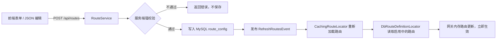

# Gateway Dashboard 使用说明手册

> 面向使用者：本文主要讲清楚一件事——**如何通过本系统实现 Spring Cloud Gateway 的动态路由配置**（查看、修改、保存、热生效、追溯），以及背后的实现原理。

## 1. 系统能做什么

本系统是 Spring Cloud Gateway 的管理后台（Gateway + 管理 API 运行在同一个 Spring Boot 进程内），核心能力：

- 登录认证：`ADMIN`（可读写）/ `VIEWER`（只读）两种角色
- 查看路由：路由列表、详情、当前生效路由、网关健康状态
- 动态修改：新建、编辑、停用/启用、删除路由
- 保存即生效：保存后无需重启网关，新配置立即生效
- 强校验：保存前校验字段、工厂名、参数绑定，错误配置上不了线
- 全程审计：谁、何时、改了什么、变更前后内容、来源 IP

## 2. 动态路由配置的实现原理

### 2.1 一句话原理

**数据库是路由配置的唯一真源**。管理端把路由写入 MySQL，网关通过自定义的路由定位器从数据库读取，保存动作触发一次"路由刷新事件"，网关内存中的路由立即更新——整个过程不需要重启进程。

### 2.2 一次"保存"发生了什么



### 2.3 关键机制说明

| 环节 | 实现 | 说明 |
|---|---|---|
| 真源 | `route_config` 表 | 路由配置唯一权威位置，重启不丢 |
| 读取 | `DbRouteDefinitionLocator` | 实现 Spring Cloud Gateway 的 `RouteDefinitionLocator` 接口，只返回启用中的路由 |
| 生效 | `RefreshRoutesEvent` | 保存/停用/删除后由 `RouteRefreshService` 发布，网关监听后重新加载路由 |
| 校验 | `RouteValidator` | 工厂名取自网关工厂的 `name()`，并用网关自身的 `ConfigurationService` 对参数做"试绑定" |
| 验证 | `GatewayStatusService` | 只读展示当前生效路由与最近刷新时间，用于确认保存已生效 |

对应代码位置：

- [DbRouteDefinitionLocator](../backend/src/main/java/com/gatewaydashboard/route/DbRouteDefinitionLocator.java)
- [RouteRefreshService](../backend/src/main/java/com/gatewaydashboard/route/RouteRefreshService.java)
- [RouteService](../backend/src/main/java/com/gatewaydashboard/route/RouteService.java)
- [RouteValidator](../backend/src/main/java/com/gatewaydashboard/route/RouteValidator.java)
- [GatewayStatusService](../backend/src/main/java/com/gatewaydashboard/gateway/GatewayStatusService.java)

> **注意**：v1 的业务路由全部由数据库管理，`application.yml` 中不写业务路由，避免两套来源叠加造成困惑。

## 3. 环境准备与安装

### 3.1 依赖清单

| 依赖 | 版本 | 说明 |
|---|---|---|
| JDK | 21 | 后端运行环境 |
| Maven | 3.9+ | 后端构建 |
| MySQL | 8.x（推荐 8.4 LTS） | 路由配置真源 |
| Node.js | 20+ | 前端构建运行 |

### 3.2 初始化 MySQL

```bash
brew install mysql@8.4
brew services start mysql@8.4
mysql -u root
```

在 `mysql>` 会话中执行：

```sql
CREATE DATABASE gateway_dashboard DEFAULT CHARACTER SET utf8mb4 COLLATE utf8mb4_unicode_ci;
CREATE USER 'gateway'@'localhost' IDENTIFIED BY 'gateway123';
GRANT ALL PRIVILEGES ON gateway_dashboard.* TO 'gateway'@'localhost';
FLUSH PRIVILEGES;
EXIT;
```

> 数据库连接信息在 `backend/src/main/resources/application-dev.yml`，可按需修改。

## 4. 启动系统

### 4.1 启动后端

```bash
cd backend
mvn spring-boot:run          # 默认 dev profile（MySQL）
```

首次启动会自动完成：Flyway 建表 → 创建预置账号 → 写入 2 条示例路由（httpbin）。

> 本机暂时没有 MySQL 时，可临时用 H2 文件库体验：`mvn spring-boot:run -Dspring-boot.run.profiles=local`（仅用于本地开发，交付/运行环境一律用 MySQL）。

### 4.2 启动前端

```bash
cd frontend
npm install
npm run dev                  # http://localhost:5173，/api 自动代理到后端 8080
```

### 4.3 登录

打开 http://localhost:5173，使用预置账号：

| 用户名 | 密码 | 角色 | 权限 |
|---|---|---|---|
| admin | admin123 | ADMIN | 查看 + 修改路由 |
| viewer | viewer123 | VIEWER | 仅查看 |

登录后可在右上角用户菜单修改自己的密码。

## 5. 路由配置基础概念

一条网关路由由以下字段组成（即 Spring Cloud Gateway 的 `RouteDefinition`）：

| 字段 | 必填 | 说明 |
|---|---|---|
| `routeId` | 是 | 路由唯一标识，只允许字母、数字、点、下划线、连字符，创建后不可修改 |
| `uri` | 是 | 目标地址，协议支持 `http/https/ws/wss/lb`，如 `http://user-service:8080` 或 `lb://user-service` |
| `order` | 否 | 匹配顺序，数字越小优先级越高，默认 0 |
| `enabled` | 否 | 是否启用，默认启用；停用 = 保留配置但不参与转发 |
| `predicates` | 启用时至少 1 个 | 匹配条件（断言），全部满足才命中该路由 |
| `filters` | 否 | 过滤器链，命中后按顺序对请求/响应做处理 |
| `metadata` | 否 | 附加元数据，任意 JSON 对象，网关不参与匹配 |

### 5.1 predicates / filters 的结构

每个 predicate / filter 都是 `{ "name": 工厂名, "args": {参数} }` 结构：

```json
{ "name": "Path", "args": { "patterns": "/api/**" } }
```

工厂名不是随便写的，必须是网关支持的工厂（页面下拉框里的列表来自 `GET /api/meta/factories`，与网关实际加载的工厂一一对应）。

### 5.2 保存前的校验规则（自动执行）

1. `routeId` 格式、唯一性（更新时不允许改 ID）
2. `uri` 必须可解析且协议受支持
3. 启用状态的路由至少有一个 predicate
4. 每个 predicate/filter 的工厂名必须存在
5. 每个工厂的参数会交给网关自身的绑定器"试绑定"，参数键写错（如 `AddRequestHeader` 漏了 `name`/`value`）会被直接拦下
6. 参数值只允许字符串、数字、布尔值

校验不通过时不会保存，页面会列出具体错误。

## 6. 页面操作指南

### 6.1 查看路由

左侧菜单 **路由管理**：表格展示路由 ID、目标地址、predicates/filters、顺序、启用状态、更新时间。顶部搜索框支持按路由 ID / URI 模糊搜索。

### 6.2 新建路由（表单模式）

1. 点击右上角 **新建路由**（仅 ADMIN 可见）
2. 填写路由 ID、目标地址 URI、执行顺序，选择启用状态
3. 添加 **Predicate**：下拉选择工厂（如 `Path`），参数框填 JSON（如 `{"patterns": "/api/**"}`）
4. 按需添加 **Filter**：同上（如 `AddRequestHeader` → `{"name": "X-Source", "value": "gateway"}`）
5. 填元数据（可选，默认 `{}`）
6. 点击 **保存并生效**

保存成功后弹窗提示，路由立即进入"网关状态"页的生效列表。

### 6.3 高级 JSON 模式

编辑抽屉底部点击 **高级 JSON 模式**，可整体编辑完整路由 JSON（适合复制粘贴、批量调整、给熟悉 Gateway 的工程师用）：

```json
{
  "routeId": "order-service",
  "uri": "lb://order-service",
  "order": 10,
  "enabled": true,
  "predicates": [
    { "name": "Path", "args": { "patterns": "/api/order/**" } },
    { "name": "Method", "args": { "methods": "GET,POST" } }
  ],
  "filters": [
    { "name": "StripPrefix", "args": { "parts": 2 } },
    { "name": "AddRequestHeader", "args": { "name": "X-Env", "value": "prod" } }
  ],
  "metadata": { "owner": "order-team" }
}
```

JSON 模式保存前同样走服务端强校验。

### 6.4 编辑路由

列表行操作点击 **编辑**：可修改 URI、顺序、predicates、filters、metadata、启用状态；路由 ID 不可修改。

### 6.5 停用 / 启用

- **停用**：路由不再参与转发，但配置保留，随时可重新启用
- **启用**：重新参与转发（启用前会再次校验，校验不过不允许启用）

适合"临时下线路由但不删配置"的场景。

### 6.6 删除路由

行操作点击 **删除**，二次确认后执行。删除会同步从生效路由中移除，并记录审计（变更前内容保留在审计日志，可人工回查恢复）。

### 6.7 网关状态页（验证是否生效）

左侧菜单 **网关状态**：展示健康状态（数据库连通性）、最近刷新时间、**当前生效路由列表**。

如果配置了 `external-gateways`，页面下方还会展示每个**外部网关实例**：在线状态、最近一次推送的结果与时间、该实例当前的生效路由列表——保存路由后可以在这里直接确认推送是否成功。

判断"保存是否生效"的标准操作：

1. 保存 / 停用 / 启用路由
2. 打开网关状态页点击 **刷新**
3. 生效路由列表出现 / 消失即说明已热生效

### 6.8 操作日志

左侧菜单 **操作日志**：分页展示每次 创建/修改/删除/停用/启用 的记录，展开行可查看变更前后的完整 JSON。误操作后可据此人工恢复。

## 7. 常用 Predicate / Filter 配置示例

以下示例可直接复制到参数 JSON 框中（args 的值）或用于高级 JSON 模式。

### 7.1 常用 Predicates

| 工厂 | 含义 | args 示例 |
|---|---|---|
| `Path` | 路径匹配 | `{"patterns": "/api/**"}`（多个用逗号：`"/a/**,/b/**"`） |
| `Method` | 请求方法 | `{"methods": "GET,POST"}` |
| `Header` | 请求头匹配 | `{"header": "X-Request-Id", "regexp": "^[0-9]+$"}` |
| `Query` | 查询参数匹配 | `{"param": "debug", "regexp": "true"}` |
| `Host` | 域名匹配 | `{"patterns": "**.example.com"}` |
| `Cookie` | Cookie 匹配 | `{"name": "session", "regexp": "abc.*"}` |
| `RemoteAddr` | 来源 IP | `{"sources": "192.168.1.0/24"}` |
| `Weight` | 权重分流 | `{"group": "g1", "weight": "7"}`（同 group 多条路由按权重分配） |

### 7.2 常用 Filters

| 工厂 | 含义 | args 示例 |
|---|---|---|
| `StripPrefix` | 去掉前 N 段路径 | `{"parts": 2}`（`/api/order/list` → `/list`） |
| `RewritePath` | 路径重写（支持正则捕获） | `{"regexp": "/api/(?<seg>.*)", "replacement": "/${seg}"}` |
| `SetPath` | 固定替换路径 | `{"template": "/v2/order"}` |
| `PrefixPath` | 路径加前缀 | `{"prefix": "/api"}` |
| `AddRequestHeader` | 加请求头 | `{"name": "X-Token", "value": "abc"}` |
| `SetRequestHeader` | 覆盖请求头 | `{"name": "X-User", "value": "guest"}` |
| `RemoveRequestHeader` | 删除请求头 | `{"name": "Authorization"}` |
| `AddResponseHeader` | 加响应头 | `{"name": "X-Gateway", "value": "gd"}` |
| `RemoveResponseHeader` | 删除响应头 | `{"name": "Server"}` |
| `PreserveHostHeader` | 透传原始 Host | `{}`（无参数） |
| `Retry` | 失败重试 | `{"retries": 3, "statuses": "BAD_GATEWAY,SERVICE_UNAVAILABLE", "methods": "GET"}` |
| `RequestSize` | 请求体大小限制 | `{"maxSize": "5000000"}` |
| `DedupeResponseHeader` | 响应头去重 | `{"name": "Set-Cookie", "strategy": "RETAIN_FIRST"}` |

> 示例：给 `/api/order/**` 加 2 层前缀剥离并附加请求头，保存后 `curl http://localhost:8080/api/order/v1/list` 会被转发到 `http://order-service:8080/v1/list`（含 `X-Env: prod` 请求头）。

## 8. 通过 API 脚本化管理动态路由

管理后台的每个操作都有对应 API，适合自动化/脚本化：

### 8.1 登录获取 Token

```bash
TOKEN=$(curl -s -X POST http://localhost:8080/api/auth/login \
  -H 'Content-Type: application/json' \
  -d '{"username":"admin","password":"admin123"}' \
  | python3 -c 'import sys,json;print(json.load(sys.stdin)["data"]["token"])')
```

### 8.2 创建路由（保存即生效）

```bash
curl -X POST http://localhost:8080/api/routes \
  -H "Authorization: Bearer $TOKEN" -H 'Content-Type: application/json' \
  -d '{
    "routeId": "demo-api",
    "uri": "http://httpbin.org",
    "order": 1,
    "enabled": true,
    "predicates": [{"name": "Path", "args": {"patterns": "/demo/**"}}],
    "filters": [],
    "metadata": {}
  }'
```

### 8.3 其他操作

```bash
# 只校验不保存
curl -X POST http://localhost:8080/api/routes/validate \
  -H "Authorization: Bearer $TOKEN" -H 'Content-Type: application/json' \
  -d '{"routeId":"x","uri":"http://a","enabled":true,"predicates":[{"name":"NoSuch","args":{}}],"filters":[],"metadata":{}}'

# 更新路由
curl -X PUT http://localhost:8080/api/routes/demo-api \
  -H "Authorization: Bearer $TOKEN" -H 'Content-Type: application/json' -d '{...}'

# 停用 / 启用
curl -X POST http://localhost:8080/api/routes/demo-api/enabled \
  -H "Authorization: Bearer $TOKEN" -H 'Content-Type: application/json' \
  -d '{"enabled": false}'

# 删除
curl -X DELETE http://localhost:8080/api/routes/demo-api -H "Authorization: Bearer $TOKEN"

# 查看生效路由与最近刷新时间
curl -s http://localhost:8080/api/gateway/status -H "Authorization: Bearer $TOKEN"

# 查看审计日志
curl -s "http://localhost:8080/api/audit-logs?page=1&size=20" -H "Authorization: Bearer $TOKEN"
```

完整接口清单见根目录 [README.md](../README.md#api-摘要)。

## 9. 常见问题（FAQ）

**Q1：保存报"参数不合法: ..."？**
参数键与网关工厂的配置项不匹配。对照第 7 节示例检查 args 的键名，例如 `AddRequestHeader` 必须用 `name`/`value`。

**Q2：保存报"未知的工厂名: xxx"？**
工厂名必须来自页面下拉框（或 `GET /api/meta/factories`），手输不存在的名字会被拦截。

**Q3：保存成功了，但"网关状态"页没有新路由？**
打开网关状态页点击 **刷新**。若仍没有，检查路由是否为启用状态（停用的路由不会出现在生效列表）。

**Q4：路由停用/删除了，但请求还是被转发？**
确认所有实例都已处理刷新事件（v1 为单实例）；若重启过网关，生效路由从数据库重新加载，停用/删除状态不会丢。

**Q5：登录提示 401？**
Token 有效期 12 小时，过期后重新登录。

**Q6：登录成功但操作按钮不可见 / 写操作返回 403？**
当前账号是 `VIEWER`（只读）。使用 `admin` 账号，或让管理员调整角色（v1 未提供用户管理页面，角色调整需改库）。

**Q7：后端启动报"Port 8080 was already in use"？**
换端口启动：`mvn spring-boot:run -Dspring-boot.run.arguments=--server.port=18080`，前端代理相应改为 `VITE_PROXY_TARGET=http://localhost:18080 npm run dev`。

**Q8：示例路由 httpbin 转发失败？**
示例路由指向 `http://httpbin.org`，需要外网可达；外网不通时页面操作不受影响，只是该路由转发失败。可改为内网可达的上游地址。

**Q9：误删了路由怎么办？**
审计日志中保留删除前的完整 JSON，可据此在"新建路由"的高级 JSON 模式中恢复。

**Q10：直接访问后端端口（如 8080）为什么弹浏览器原生登录框？**
后端是 API/网关服务，没有页面；根路径是受保护资源，未登录时旧版本会返回 `WWW-Authenticate: Basic` 导致浏览器弹原生认证框（该框无法用账号密码登录，因为认证走 JWT 而非 HTTP Basic）。现已修复：未登录返回 JSON `{"code":401,...}`，无权限返回 `{"code":403,...}`，不再弹框。正确入口是前端页面（默认 http://localhost:5173）。

## 10. 对接外部网关（管理独立部署的 Gateway）

仪表盘默认管理的是**自己进程内嵌的网关**。如果网关是独立部署的进程（例如跑在 `http://localhost:8088` 的 `gateway-demo`），需要把网关工程接入"数据库路由源"：

### 10.1 网关工程需要做的改动

1. `pom.xml` 增加依赖：`spring-boot-starter-jdbc`、`mysql-connector-j`
2. `application.yml` 增加数据源（指向与仪表盘相同的 `gateway_dashboard` 库），并把业务路由从 YAML 中移除：

```yaml
spring:
  datasource:
    url: jdbc:mysql://localhost:3306/gateway_dashboard?useUnicode=true&characterEncoding=utf8&serverTimezone=Asia/Shanghai&useSSL=false&allowPublicKeyRetrieval=true
    username: gateway
    password: gateway123

gateway-dashboard:
  route-sync:
    poll-interval-ms: 5000          # 轮询兜底间隔
    internal-token: gd-internal-token-dev
```

3. 加入以下 6 个类（可直接参考本仓库 `gateway-demo/` 中已集成的版本）：

| 类 | 作用 |
|---|---|
| `DbRouteDefinitionLocator` | 从 `route_config` 表读取启用中的路由，接入网关路由加载 |
| `RouteConfigRow` | 路由行数据载体 |
| `RouteSyncProperties` | 轮询间隔与内部 token 配置 |
| `RouteRefreshPublisher` | 发布 `RefreshRoutesEvent` |
| `RouteSyncScheduler` | 每 5 秒比较（行数, 最大版本号），变化即刷新 |
| `RouteRefreshController` | `POST /internal/routes/refresh`（推送刷新）、`GET /internal/routes`（查看生效路由），需带 `X-Internal-Token` |

并在启动类加 `@EnableScheduling`。

### 10.2 仪表盘配置外部网关

仪表盘保存/删除/停用路由后，会自动向配置的外部网关推送刷新：

```yaml
gateway-dashboard:
  external-gateways:
    - base-url: http://localhost:8088
      token: gd-internal-token-dev   # 与网关工程 internal-token 一致
```

### 10.3 生效方式

- **主动推送**：保存后立即调用外部网关 `POST /internal/routes/refresh`，秒级生效
- **轮询兜底**：即使推送失败（网关短暂不可达等），网关每 5 秒检查一次数据库（行数 + 最大版本号），最多延迟一个轮询周期生效
- **推送与轮询不重复**：推送刷新成功后会把当前数据库校验和同步给轮询器，同一次变更不会重复触发刷新；之后若校验和再次变化，轮询仍会正常兜底
- **重启持久化**：网关重启后从数据库重新加载全部启用中的路由，配置不丢
- **状态可视化**：仪表盘"网关状态"页展示每个外部网关实例的在线状态、最近推送结果、生效路由，推送是否成功一目了然

> 注意：`internal-token` 生产环境请改为强随机值，并限制 `/internal/**` 仅内网访问。

## 11. 权限配置（接口权限动态配置）

接口访问权限不再写死在代码里，而是存在数据库 `permission_rule` 表中，可随时调整、即时生效。

### 11.1 工作原理

`SecurityConfig` 只保留两条引导规则（`/api/auth/login`、`/actuator/health` 永远公开），其余请求全部交给动态授权管理器：按请求的（HTTP 方法, 路径）在规则表中**按优先级匹配，首个命中即生效**。规则增删改后，内存快照自动刷新，下一次请求立即按新规则放行/拒绝，无需重启。

### 11.2 规则字段与角色语义

| 字段 | 说明 |
|---|---|
| `httpMethod` | `GET/POST/PUT/DELETE/PATCH/OPTIONS/HEAD` 或 `*`（任意方法） |
| `pathPattern` | Spring 路径模式，如 `/api/routes/**` |
| `roles` | `*` = 公开；`AUTHENTICATED` = 任意登录用户；角色列表如 `ADMIN,VIEWER`（逗号分隔） |
| `priority` | 优先级，数字越小越先匹配；首个命中生效 |
| `enabled` | 停用后该规则不参与匹配 |
| `builtin` | 内置规则，初始化时创建，**不可删除** |

### 11.3 新增一个功能模块的接入方式

假设新增模块 `/api/report/**`（报表），希望 ADMIN 可读写、VIEWER 可读：

1. 权限配置页新建两条规则：
   - `GET /api/report/**` → `ADMIN,VIEWER`，优先级 10
   - `POST/PUT/DELETE /api/report/**` → `ADMIN`，优先级 20
2. 保存后即时生效，无需改代码、无需重启。

### 11.4 自我保护

系统会拦截两类危险操作：删除内置规则；以及"保存后 ADMIN 将失去权限配置模块访问权"的改动（防止把自己锁死）。若误操作导致权限异常，仍可通过 `POST /api/auth/login` 登录（引导规则不落库），并直接修改 `permission_rule` 表恢复。

## 12. 已知边界与扩展方向

当前为 v1（单实例、保存即生效、无草稿），已知边界：

- 多实例网关需要刷新传播机制（如 Redis pub/sub 或版本轮询），v1 按单实例设计
- 无草稿/发布两阶段流程，误操作靠审计日志追溯
- 只管理路由本身，不管理全局过滤器、CORS、TLS 等网关级配置
- 用户管理（建号/改角色）页面未实现，预置 admin/viewer 两个账号

扩展方向（均可基于现有架构演进）：多实例刷新广播、草稿与回滚、配置中心（Nacos）作为真源的适配、用户与权限管理页面、路由匹配预览（输入路径模拟命中）。
